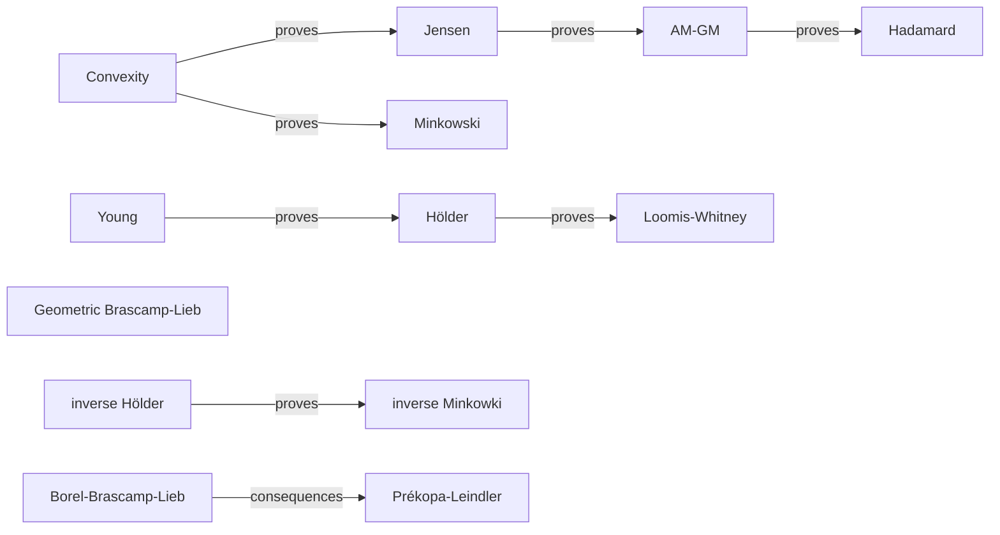

```mermaid
graph LR;
  Conv[Convexity]

  AG[AM-GM]
  BBL[Borel-Brascamp-Lieb]
  GBL[Geometric Brascamp-Lieb]
  H[Hölder]
  iH[inverse Hölder]
  Ha[Hadamard]
  J[Jensen]
  LW[Loomis-Whitney]
  M[Minkowski]
  iM[inverse Minkowki]
  PL[Prékopa-Leindler]
  Y[Young]
  
  Conv -- proves --> J
  Conv -- proves --> M
  Y -- proves --> H;
  J -- proves --> AG;
  AG -- proves --> Ha;
  H -- proves --> LW
  iH -- proves --> iM
  BBL -- consequences --> PL

```

